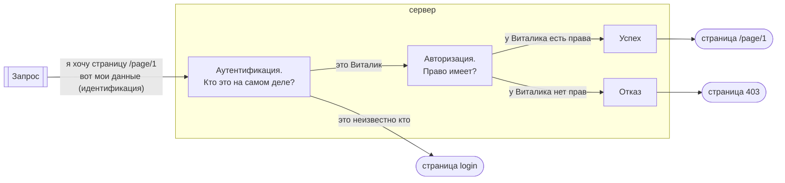
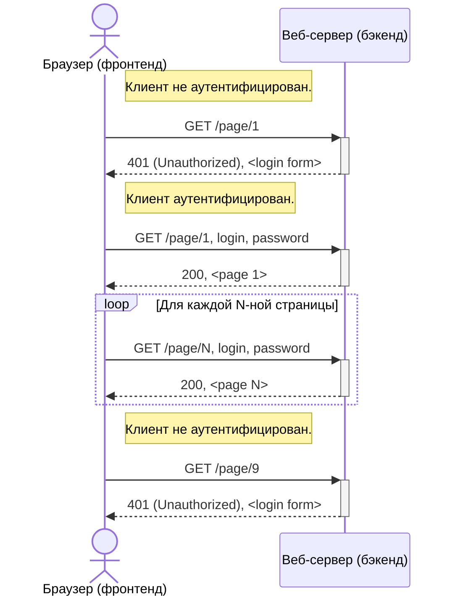
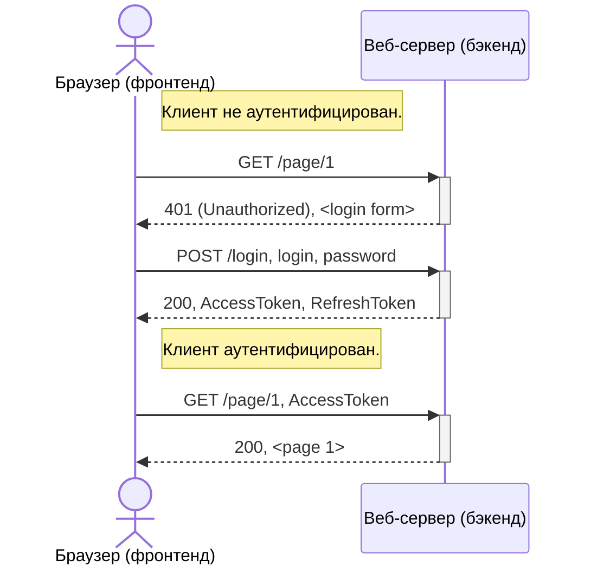
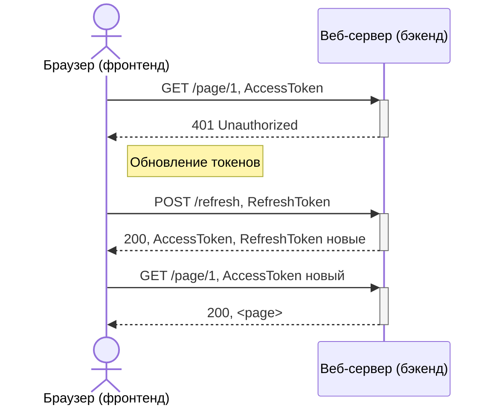
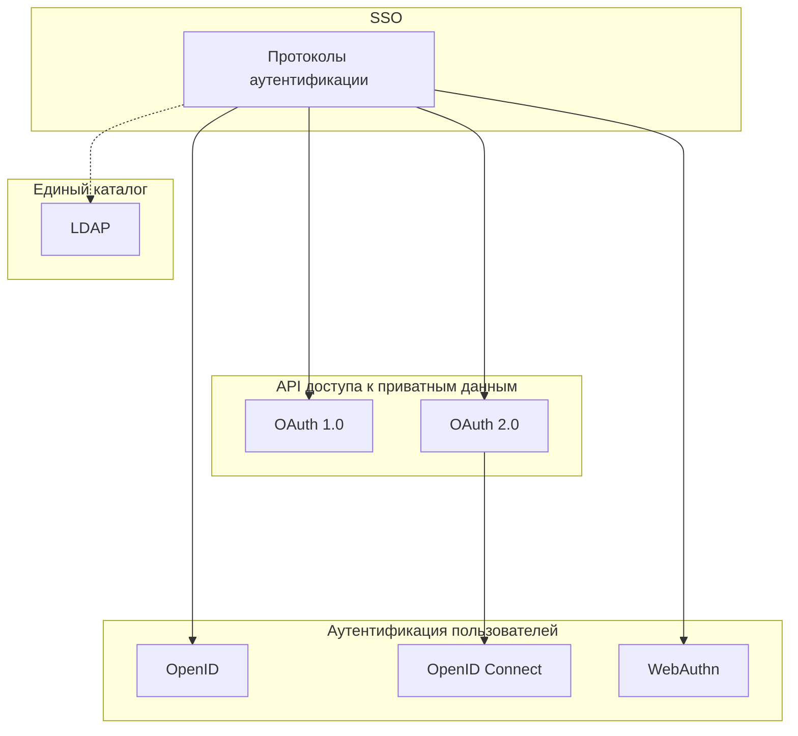

# JWT (JSON Web Tokens)

## Информационная безопасность

- Регистрация
- Разграничение доступа
  - Получение конфиденциальных данных
  - Совершение привилегированных действий
  - Свой профиль
- Протоколирование и аудит
  - История действий
- Администрирование и управление ролями

----

## Разграничение доступа

Тварь я дрожащая, или право имею? Отличие авторизации и аутентификации.

----

## Вариант №1: Авторизация по логину-паролю:

Архаичный механизм, сейчас так почти никто не делает из-за ненадёжности в плане ИБ.

Редкое исключение — секретная ссылка на действие (например для отписки или удаление документа).

Минусы:
 - Браузер хранит пароль и передаёт в каждом запросе
 - Зная пароль, злоумышленник может незаметно им пользоваться
 - Нельзя закрыть доступ злоумышленнику, не изменив пароль
 - Не получится менять пароль достаточно часто

----

## Вариант №2: Сессия пользователя

Суть решения — разделить идентификационные данные (credentials) и токен авторизации. Для авторизации используется временный session-id.

Минусы:
 - При смене сессии нужно заново отправлять пароль
 - Проблемы масштабирования

----

## Вариант №3: JWT (RFC 7519)

Суть решения — автоматическая смена токена авторизации.

После аутентификации клиент получает два токена — Access Token и Refresh Token. Access Token используется как session-id и так же ограничен по времени.

Refresh Token одноразовый, используется для обновления Access Token'а.

Реализация: своя либо библиотека, например https://auth0.com/

## Криптография и масштабирование

Важная особенность — токен это JSON с идентификатором пользователя, подписанный криптографической подписью. Никакие секретные ключи в запросах не передаются.

Формат токена — строка `{заголовок}.{тело}.подпись`, закодированная в base64.

Пример: https://jwt.io/

Проверить через https://www.base64decode.org/

Тело хранит идентификатор пользователя и время действия токена, а подпись гарантирует подлинность. Криптография даёт возможность не хранить токен в БД, как id сессии, а проверять валидность токена распределённо.

Токен кодируется в base64, чтобы упростить его хранение и передачу в виде текста.

На клиенте токен хранится в куки или в локальном хранилище браузера:
 - Хранение в локальном хранилище дает доступ к токену клиенту, это и плюс и минус (уязвимость к CSRF).
 - Хранение в httpOnly кукис не даёт возможности прочитать токен из скриптов на стороне фронтенда.

# SSO (Single sign-on)

"Технология единого входа". Решаемая проблема — исключить хранение и передачу идентификационных данных. Суть решения — делегировать задачу аутентификации стороннему провайдеру. Это позволит клиенту вообще не присылать критичные данные (логин-пароль), если он уже аутентифицирован на стороне провайдера.

Существует несколько протоколов:

LDAP — централизованная директория аккаунтов; не подходит для сайтов в интернете.

OpenID — одна из первых реализаций SSO.

OAuth/OAuth2 — может авторизировать действия приложения-клиента у провайдера (api). RFC 6749, 2008-2013 года.

OpenID Connect (не путать с OpenID) — аутентификация пользователя поверх OAuth2.

WebAuthn — поддержка большего количество средств аутентификации (напр. биометрия); другое название — Web Authentication API.

Другие протоколы: SAML, Kerberos (оставим за кадром).

Рассмотрим примеры:

- OAuth — API между сервисами для получения информации о пользователях и не только

- OpenID Connect — надстройка над OAuth для аутентификации пользователей

OAuth реализован по аналогии с JWT (access_token, Bearer Authentication) на базе ассиметричного шифрования. Хронология:
 - 2006 — OpenID
 - 2007 — OAuth 1.0 draft
 - 2010 — OAuth 1.0 RFC 5849
 - 2010 — JWT RFC 7519
 - 2012 — OAuth 2.0 RFC 6749

Суть та же — создаётся временный токен, который периодически обновляется. Если провайдер перестанет аутентифицировать пользователя, приложение-потребитель на это отреагирует за время не превышающее срок жизни токена.

Связь между потребителем и провайдером, между провайдером и клиентом, а также конкретный механизм аутентификации независимы друг от друга. Это даёт функциональную гибкость и при этом надёжность с точки зрения ИБ.

Для пользователя не всегда понятно, когда применялось SSO (пример с VK Connect). Сторонний провайдер также может предоставлять другие способы проверки подлинности (например, смс на телефон).

## Пример внедрения OAuth и OpenID Connect

https://testit.software/

Изначально разграничение доступа было сделано через JWT. После чего добавлена аутентификация через OpenID Connect (слой аутентификации в OAuth 2.0).

- Основная работа на стороне бэкенда
- Не работает без HTTPS
- В аккаунт зайти как по OpenID, так и просто с логином-паролем

Как выглядит для администратора системы:

1. Настроить подключение OpenID Connect (адрес провайдера, идентификатор, ключ), опционно иконку.
2. Указать данные о пользователях, которые получит приложение. Минимальный набор — OpenID, email, profile.

После этого у пользователей получается кнопка с иконкой, при нажатию на которую перенаправляет на веб-страницу провайдера аутентификации и затем обратно.

Также добавлена интеграция с Jira по OAuth 1.0.

Как выглядит для администратора системы:

1. В администрировании приложения берём публичный ключ
2. В Jira в настройках добавляем приложение, указываем там этот ключ
3. В приложении включаем интеграцию с Jira

Позволяет приложению создавать тикеты в Jira через API.
