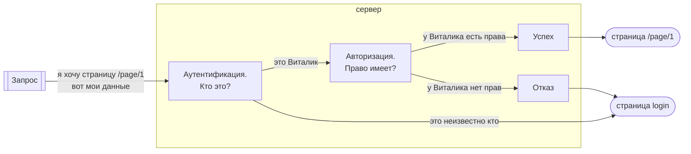
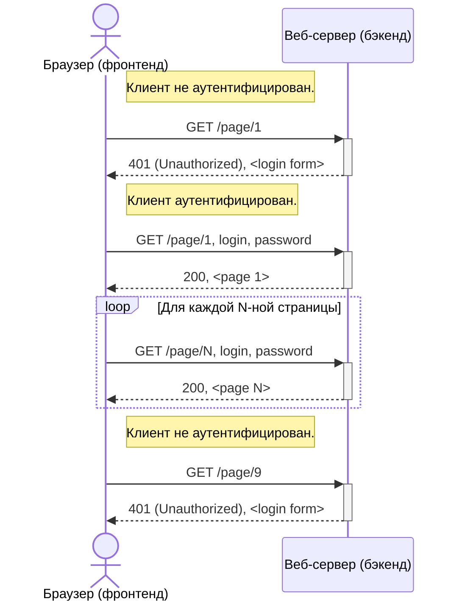
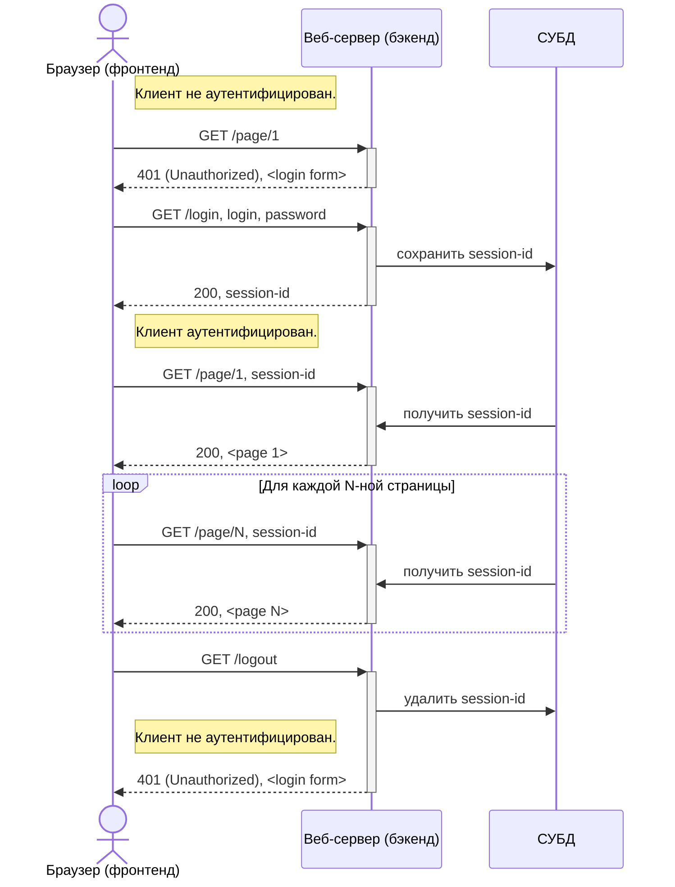

## Информационная безопасность

- Регистрация
- Разграничение доступа
  - Получение конфиденциальных данных
  - Совершение привилегированных действий
  - Свой профиль
- Протоколирование и аудит
  - История действий
- Администрирование и управление ролями

## Разграничение доступа

Тварь я дрожащая, или право имею?

## Вариант №1: Авторизация по логину-паролю:

Минусы:
 - Пароль передается в каждом запросе
 - Зная пароль, злоумышленник может незаметно им пользоваться
 - Нельзя закрыть доступ злоумышленнику, не изменив пароль
 - Не получится менять пароль достаточно часто

## Вариант №2: Сессия пользователя

Суть решения — разделить идентификационные данные (credentials) и токен авторизации. Для авторизации используется временный session-id.

Минусы:
 - Проблемы масштабирования
 - При смене сессии нужно заново отправлять пароль

## Вариант №3: JWT (RFC 7519)

Суть решения — автоматическая смена токена авторизации.

Создаются два токена — Access Token и Refresh Token. Access Token используется как session-id и так же ограничен по времени. Refresh Token одноразовый, используется для обновления Access Token'а.